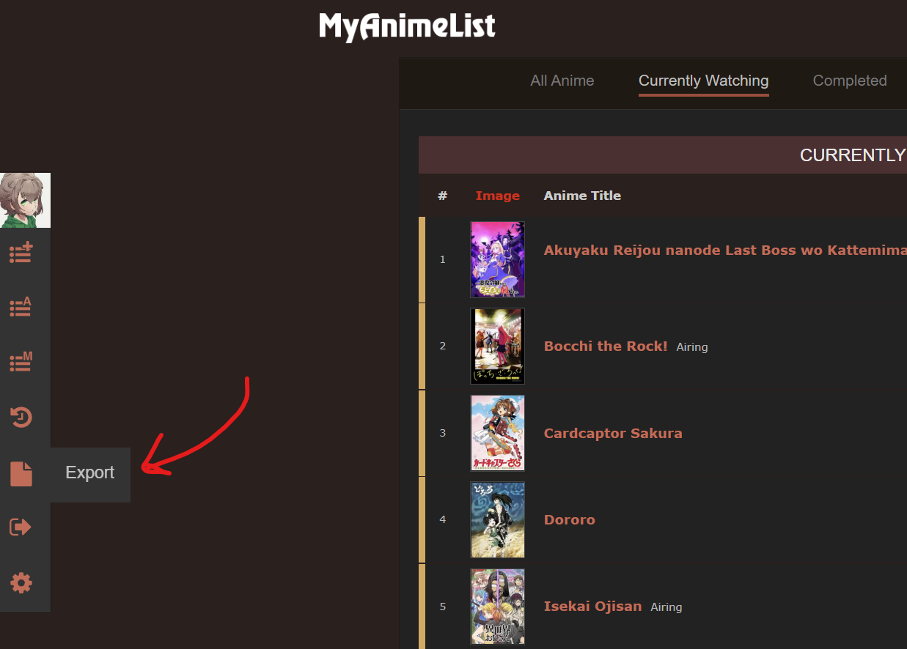

# My anime list recommender
## Requirements
- [Pandas](https://pypi.org/project/pandas/)

## Datasets
### [AnimeList.csv](https://www.kaggle.com/datasets/azathoth42/myanimelist?resource=download&select=AnimeList.csv)
AnimeList.csv contains list of anime, with title, title synonyms, genre, studio, licensor, producer, duration, rating, 
score, airing date, episodes, source (manga, light novel etc.) and many other important data about individual anime 
providing sufficient information about trends in time about important aspects of anime. Rank is in float format in csv, 
but it contains only integer value. This is due to NaN values and their representation in pandas.

### UserMAL.csv 
To get your own UserMAL.csv based on your watched list please read the following indications:
#### Step 1: Get the generated MAL XML file

#### Step 2: Convert the generated XML file to a CSV file
For this step a home-made converter will be necessary, this project hasn't implemented one yet. If you're not
comfortable with software development this [online converter](https://www.convertcsv.com/xml-to-csv.htm) 
should work properly.

#### Step 3: Replace the old UserMAL.csv by your own
The easiest way is to simply rename your csv file "UserMAL.csv". If you want to keep a custom name, you can change the
path in the `main.py` file.
